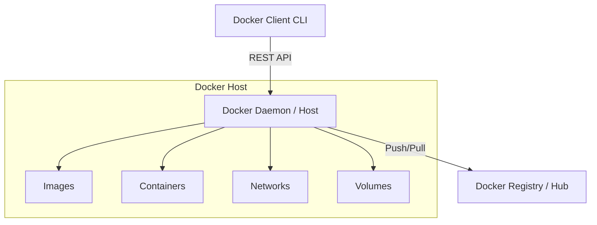
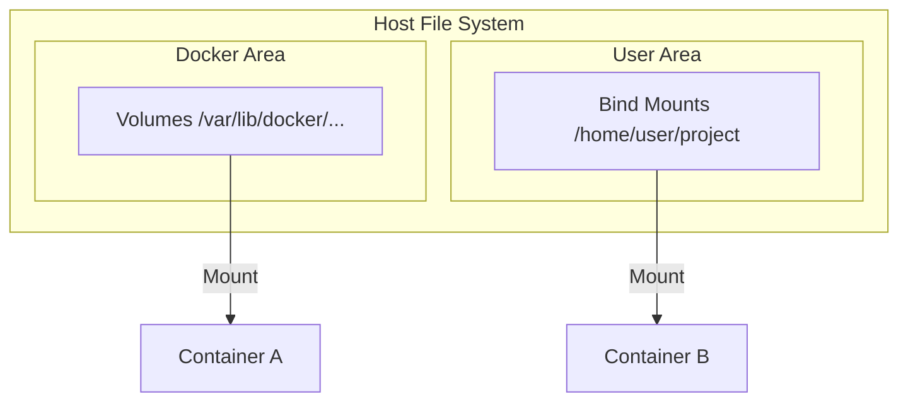

# Docker Learning & Concept Guide

This guide covers core Docker concepts, architectures, and practices necessary to master containerization.

---

## 📋 Table of Contents
1. [Core Docker Architecture](#1-core-docker-architecture)
2. [Anatomy of a Dockerfile](#2-anatomy-of-a-dockerfile)
3. [Optimizing Docker Images & Multi-Stage Builds](#3-optimizing-docker-images--multi-stage-builds)
4. [Volumes vs. Bind Mounts](#4-volumes-vs-bind-mounts)
5. [Docker Network Types](#5-docker-network-types)
6. [Multi-Container Orchestration with Docker Compose](#6-multi-container-orchestration-with-docker-compose)

---

## 1. Core Docker Architecture

Docker uses a client-server architecture. The **Docker Client** talks to the **Docker Daemon (dockerd)**, which does the heavy lifting of building, running, and distributing your Docker containers.



- **Docker Daemon (`dockerd`)**: The background service running on the host that manages Docker objects.
- **Docker Client (`docker`)**: The CLI tool used by developers to interact with the daemon.
- **Docker Image**: A read-only template with instructions for creating a Docker container.
- **Docker Container**: A runnable instance of an image. It is isolated from the host and other containers.
- **Docker Registry**: A service (like Docker Hub or GitHub Packages) that stores and distributes Docker images.

---

## 2. Anatomy of a Dockerfile

A `Dockerfile` is a text document that contains all the commands a user could call on the command line to assemble an image.

Here is a standard, commented Dockerfile for a Node.js web application:

```dockerfile
# 1. Base Image - Use an official runtime as a parent image
FROM node:18-alpine

# 2. Working Directory - Set the working directory inside the container
WORKDIR /usr/src/app

# 3. Cache Optimization - Copy dependency manifests first to leverage Docker layer caching
COPY package*.json ./

# 4. Install Dependencies - Run build command
RUN npm ci --only=production

# 5. Copy Source Code - Copy the rest of the application files
COPY . .

# 6. Port Exposure - Document the port the container listens on at runtime
EXPOSE 3000

# 7. Default Command - Command that runs when starting the container
CMD ["node", "src/index.js"]
```

---

## 3. Optimizing Docker Images & Multi-Stage Builds

### Layer Caching
Each instruction in a Dockerfile creates a read-only layer. Docker caches these layers to speed up subsequent builds. 
- Order your Dockerfile from **least frequently changed** files/commands to **most frequently changed**.
- Combine multiple shell commands using `&&` and backslashes `\` to keep layer counts minimal.

### Multi-Stage Builds
Multi-stage builds allow you to use multiple `FROM` statements in a single Dockerfile. You can compile your code in a build environment and copy only the final artifacts to a lightweight production image, saving significant disk space.

```dockerfile
# --- Stage 1: Build / Compilation ---
FROM node:18-alpine AS builder
WORKDIR /app
COPY package*.json ./
RUN npm install
COPY . .
RUN npm run build  # Compiles TypeScript/assets into /app/dist

# --- Stage 2: Production Runtime ---
FROM node:18-alpine AS production
WORKDIR /app
COPY package*.json ./
RUN npm ci --only=production
# Copy compiled code from the builder stage
COPY --from=builder /app/dist ./dist

EXPOSE 3000
CMD ["node", "dist/index.js"]
```

---

## 4. Volumes vs. Bind Mounts

Docker provides two primary ways to persist data from the container onto the host machine:

| Feature | Volumes | Bind Mounts |
| :--- | :--- | :--- |
| **Storage Location** | Managed by Docker (e.g. `/var/lib/docker/volumes/` on Linux) | Anywhere on the host machine filesystem |
| **Creation** | Created and managed via Docker CLI or Compose | Created by referencing host directory paths |
| **Portability** | High (backed up, shared, managed easily) | Low (tied to host directory structures) |
| **Usage** | Production databases, sharing data between containers | Local development (sharing source code into containers) |



---

## 5. Docker Network Types

Docker containers can be attached to various network drivers depending on the communication requirements:

1. **Bridge (Default)**: Creates an isolated internal network on the host. Containers on the same bridge network can communicate using IP addresses or container names (automatic DNS resolution).
2. **Host**: Removes network isolation between the container and the host. The container uses the host's networking namespace directly (faster performance, but ports must not conflict).
3. **Overlay**: Enables communication between containers running on different physical hosts (used in Docker Swarm or Kubernetes clusters).
4. **None**: Disables all networking for the container. Useful for isolated, sandboxed offline tasks.

---

## 6. Multi-Container Orchestration with Docker Compose

Docker Compose is a tool for defining and running multi-container Docker applications. You define your services, networks, and volumes in a single YAML file (`docker-compose.yml`).

Example `docker-compose.yml` orchestrating a Node.js web app and a PostgreSQL database:

```yaml
version: '3.8'

services:
  web:
    build: .
    ports:
      - "8080:3000"
    environment:
      - DATABASE_URL=postgres://postgres:secret@db:5432/mydb
    depends_on:
      - db
    networks:
      - app-network

  db:
    image: postgres:15-alpine
    environment:
      - POSTGRES_PASSWORD=secret
      - POSTGRES_DB=mydb
    volumes:
      - pgdata:/var/lib/postgresql/data
    networks:
      - app-network

volumes:
  pgdata:

networks:
  app-network:
    driver: bridge
```

To control your multi-container environment:
- **Start services**: `docker-compose up -d`
- **Stop services**: `docker-compose down`
- **View logs**: `docker-compose logs -f`

---

⬅️ **[Back to Home](../README.md)** | ⬅️ **[Go to Helper Commands](../commands/README.md)**
